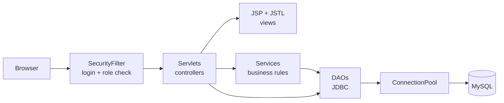
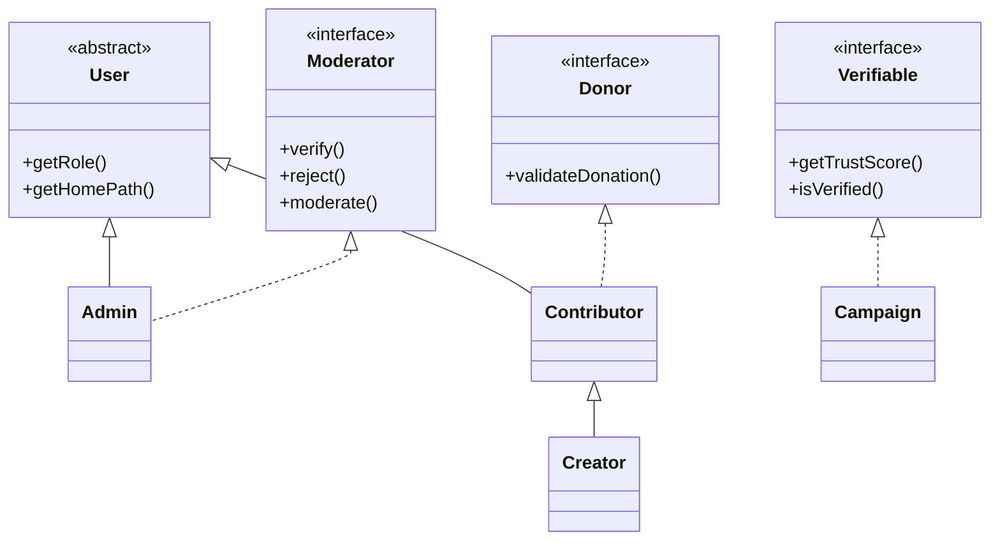

# Helping Gurus - Online Crowdfunding Platform (Java Web)

Servlets + JSP + JDBC (MySQL) web application.
**Team Leader:** Sahil Kumar  |  **Members:** Souvik Das, Rahul Verma

Users create and support fundraising campaigns (for example genetic-disease treatment such as SMA/Zolgensma, and cancer care).
An **Admin** controls authenticity: every campaign needs a 4-point check before it goes live, and every uploaded photo must be approved.
Sample campaigns and names are **fictional demo data**.

## Roles
| Role | Can do |
|---|---|
| Admin | Verify or reject campaigns (4 checks), approve or reject photos, see stats |
| Campaign Creator | Create campaigns, post updates, upload photos, invite co-organizers, also donate |
| Contributor | Browse verified campaigns, donate (optionally anonymous), comment, see contribution history |

## Tech stack
Java 17, Servlet 4 / JSP 2.3 / JSTL 1.2 (Tomcat 9), JDBC with MySQL 8, Maven (WAR).

## Architecture
Layered design: each layer only talks to the one below it.



Class hierarchy and interfaces (the core of the OOP design):



Donation flow: `DonateServlet` -> `DonationService` (validate amount, lock the campaign, check it is LIVE) -> `DonationDao.record()` (one transaction: insert donation + update campaign total) -> thank-you email queued on a background thread and statistics refreshed.

## Prerequisites
| Tool | Version | Check with |
|---|---|---|
| JDK | 17 or newer | `java -version` |
| Maven | 3.8+ | `mvn -version` |
| MySQL | 8.x, running on port 3306 | `mysql --version` |
| Apache Tomcat | **9.x** (not 10; Tomcat 10 uses `jakarta.*`) | `$CATALINA_HOME/bin/version.sh` |

## Run it
1. Install the tools above.
2. Edit `src/main/resources/db.properties` (MySQL user/password). The database and all tables are created automatically on first start, and demo data is loaded.
3. Build and deploy:
   ```bash
   mvn clean package
   cp target/helping-gurus.war $CATALINA_HOME/webapps/
   $CATALINA_HOME/bin/startup.sh     # Windows: startup.bat
   ```
4. Open http://localhost:8080/helping-gurus/

In Eclipse or IntelliJ: import as a Maven project and add the Tomcat 9 server.

### Demo logins
| Role | Email | Password |
|---|---|---|
| Admin | admin@helpinggurus.org | admin123 |
| Creator | priya@mail.com | priya123 |
| Creator | kabir@mail.com | kabir123 |
| Contributor | donor@mail.com | donor123 |

Uploaded photos are stored in `~/helping-gurus-uploads` (change `upload.dir` in `db.properties`).

### Configuration (`src/main/resources/db.properties`)
| Key | Default | Meaning |
|---|---|---|
| `db.url` | `jdbc:mysql://localhost:3306/helping_gurus?...` | JDBC URL; the database is created if missing |
| `db.user` / `db.password` | `root` / `root` | **Change to your MySQL credentials** |
| `db.poolSize` | `5` | Number of pooled connections |
| `upload.dir` | `${user.home}/helping-gurus-uploads` | Where uploaded photos are saved |

Any key can also be overridden at start-up without editing the file, for example `-Ddb.password=secret` in `CATALINA_OPTS`.

### Troubleshooting
| Problem | Fix |
|---|---|
| `Access denied for user 'root'` at start-up | Put your real MySQL user and password in `db.properties`, rebuild, redeploy |
| `Communications link failure` | MySQL is not running or not on port 3306; start it or change `db.url` |
| `ClassNotFoundException: javax.servlet...` or a blank 404 page | You are on Tomcat 10; use **Tomcat 9** |
| Port 8080 already in use | Change the connector port in `$CATALINA_HOME/conf/server.xml` |
| Uploaded photos do not show | They stay hidden until the admin approves them (Admin panel -> Photo moderation) |
| Want fresh demo data | Drop the `helping_gurus` database and restart; it is recreated and re-seeded |

## Project structure
```
src/main/java/com/helpinggurus
  model/      User (abstract), Admin, Contributor, Creator, Campaign, Photo, Donation, Post,
              interfaces Donor, Verifiable, Moderator
  exception/  HelpingGurusException, DataAccessException, InvalidDonationException, VerificationException
  dao/        Dao<T,ID> (generic interface), BaseDao (all JDBC), UserDao, CampaignDao, PhotoDao, DonationDao, PostDao
  service/    DonationService, NotificationService, StatsService, SchemaInstaller, SeedData
  util/       ConnectionPool, PasswordUtil (PBKDF2), Fmt (Indian rupee format)
  web/        Servlets: Home, Campaign, Auth, Donate, Comment, MyDonations, Creator, Admin, Photo
              SecurityFilter (role protection), AppListener (startup)
src/main/webapp/WEB-INF/views/   JSP pages (header.jspf / footer.jspf are shared)
src/main/resources/              schema.sql, db.properties
```

## Marking rubric mapping
**Problem understanding and solution design**
- Problem: fake campaigns, misused photos and unaffordable genetic-disease and cancer treatment for lower-middle-class Indian families.
- Solution: admin-controlled authenticity (4 checks), photo moderation, collaborative organizers, transparent progress.

**Core Java concepts**
| Concept | Where |
|---|---|
| Inheritance | `Admin`, `Contributor` extend `User`; `Creator` extends `Contributor` |
| Abstraction | `User` is abstract (`getRole()`) |
| Polymorphism | `getRole()` and `getHomePath()` overridden; `User.of(...)` factory; login redirects by role |
| Interfaces | `Donor`, `Verifiable`, `Moderator`, generic `Dao<T,ID>`, functional `RowMapper`, `SqlFunction` |
| Encapsulation | private fields with getters/setters everywhere |
| Exception handling | custom checked exceptions; servlets turn them into friendly messages; try-with-resources in JDBC |
| Collections and generics | `List`, `Map` (TreeMap category counts), `Set`, streams with `Comparator`; generic `Dao<T,ID>`, `query<T>()` |
| Multithreading | `ConnectionPool` (BlockingQueue), `NotificationService` worker thread (producer-consumer), `StatsService` (ScheduledExecutorService + atomics), per-campaign `ReentrantLock` in `DonationService` |

**Database integration (JDBC)**
- `ConnectionPool` opens connections with `DriverManager`, configured from `db.properties`.
- All SQL uses `PreparedStatement` (no SQL injection). `BaseDao` provides `query`, `update`, `insert`.
- Transactions: `DonationDao.record()` inserts the donation and updates the campaign total atomically (commit or rollback).
- DAO classes: one per table, with `JOIN` queries and generated keys.

**Servlets and web integration**
- 9 servlets with `@WebServlet`; `@MultipartConfig` file upload; `SecurityFilter`; `ServletContextListener`.
- JSP + JSTL + EL pages, session handling (session id renewed at login), flash messages, custom EL function `hg:inr()`.
- Security: PBKDF2 password hashing, role checks in filter, output escaped with `c:out`.

## Database
Tables: `users`, `campaigns`, `campaign_team`, `photos`, `donations`, `posts` (see `src/main/resources/schema.sql`).

## Upload to GitHub
```bash
git init
git add .
git commit -m "Helping Gurus: Java web crowdfunding platform (Servlets, JSP, JDBC)"
git branch -M main
git remote add origin https://github.com/<your-username>/helping-gurus.git
git push -u origin main
```
Make sure reviewers can open it: set the repository to **Public** (Settings -> General -> Danger Zone -> Change visibility) or add them as collaborators.

## Future scope
CSRF tokens, payment gateway, email delivery, document upload for verification, REST API and Spring Boot version.
